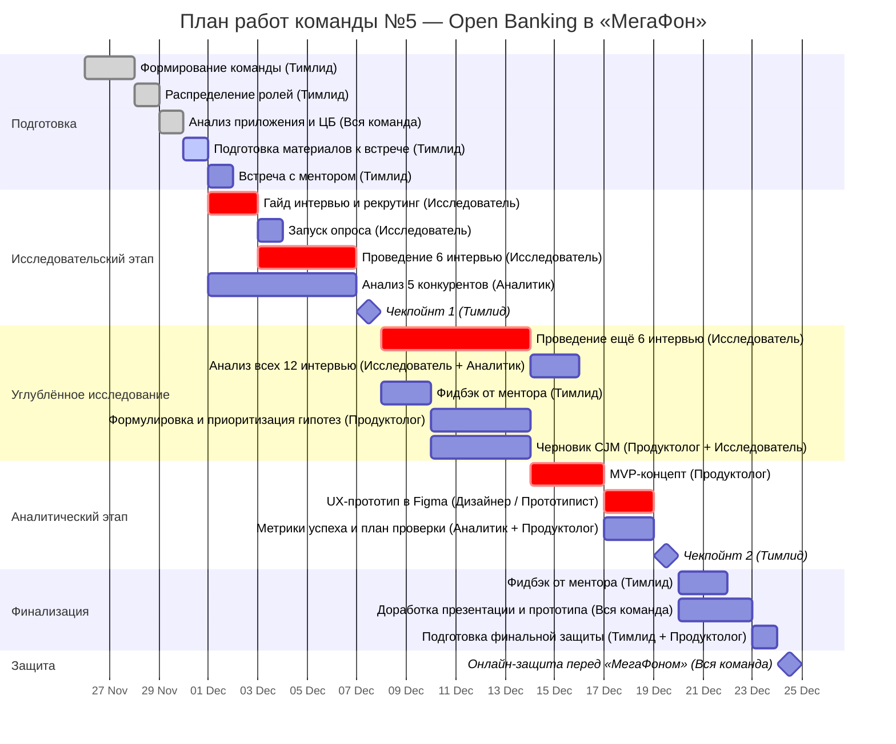

## Команда №5 — Open Banking в «МегаФон»

Участники:
- Дмитриев Дмитрий
- Кузьмицкий Дмитрий
- Данилов Глеб
- Шумко Игорь

### Наше понимание задачи:

Превратить ЛК «МегаФон» из утилитарного инструмента в **персональный финансовый хаб**, объединяющий связь и финансы, чтобы:
 - Повысить вовлечённость и retention  
 - Упростить оплату услуг без выхода из приложения  
 - Подготовить основу для развития финтех-платформы

 **Что уже есть в приложении**:  
 - Раздел **«Платежи»**: баланс, оплата, автоплатёж, переводы  
 - Раздел **«Деньги»**: займы, страховки, карты (только от партнёров)  
 - **СБП уже используется** — но пользователь **выходит в банк** для подтверждения

 **Проблема**:  
 Пользователь не видит ценности в ЛК — платит через банки, не возвращается в приложение → низкая вовлечённость + упущенные возможности монетизации.

### Распределение ролей

| Участник             | Роль                   | Ключевые задачи                                                                                                                                                                                                                                                                                                           |
| -------------------- | ---------------------- | ------------------------------------------------------------------------------------------------------------------------------------------------------------------------------------------------------------------------------------------------------------------------------------------------------------------------- |
| **Дмитриев Дмитрий** | Тимлид                 | - организует рабочий процесс команды; - распределяет задачи и контролирует сроки; - координирует коммуникацию с ментором и партнёром; - фиксирует договорённости внутри команды; - отвечает за своевременную загрузку промежуточных и итоговых материалов; - помогает корректировать роли, если требуется. |
| Кузьмицкий Дмитрий   | Исследователь          | - проводит интервью, опросы, наблюдения (онлайн/офлайн); - формирует гайды, сценарии общения, критерии отбора респондентов; - собирает данные о пользовательском опыте; - выявляет pain points, ожидания и барьеры; - готовит выводы для гипотез и CJM.                                                       |
| Шумко Игорь          | Аналитик               | - анализирует рынок, конкурентов, продукты-аналоги; - структурирует количественные данные и метрики; - помогает формировать юнит-экономику, P&L или расчёт эффектов; - поддерживает продуктолога в приоритизации гипотез; - проверяет корректность данных, предположений и расчётов.                          |
| Данилов Глеб         | Продуктолог            | - формулирует продуктовую проблему и цели; - формирует и приоритизирует гипотезы; - предлагает сценарии улучшений и варианты решений; - проектирует способ проверки гипотез (метрики, эксперименты, РОС); - собирает концепцию MVP и готовит логику roadmap.                                                  |
| **Дмитриев Дмитрий** | Дизайнер / Прототипист | - визуализирует решения для MVP: макеты, прототипы, пользовательские флоу; - работает с CJM, схемами интерфейсов, сценариями; - обеспечивает понятную подачу решения в презентации; - помогает команде донести идею через визуальные артефакты.                                                                  |

### План работ (до 24 декабря)

| Этап              | Дедлайн | Активности                                      | Ответственный            |
| ----------------- | ------- | ----------------------------------------------- | ------------------------ |
| Исследовательский | 7 дек   | Интервью (6), опрос запущен, анализ конкурентов | Исследователь + Аналитик |
| Исследовательский | 14 дек  | Интервью (12), CJM, гипотезы                    | Вся команда              |
| Аналитический     | 19 дек  | Финальные выводы, MVP-концепт, прототип в Figma | Продуктолог + Дизайнер   |
| Финализация       | 23 дек  | Презентация, фидбэк от ментора                  | Тимлид                   |
| Защита            | 24 дек  | Онлайн-защита перед «МегаФоном»                 | Вся команда              |

## 📅 **Детальный поэтапный план (до 24 декабря)**

### 📆 **До 1 декабря**
- [x] Сформировать команду
- [x] Распределить роли  
- [x] Проанализировать приложение и документы ЦБ  
- [x] Подготовить материалы к встрече с ментором

### 📆 **1–7 декабря**
- [ ] Составить **гайд интервью** и **план рекрутинга**
- [ ] Запустить **опрос**
- [ ] Провести **6 интервью**  
- [ ] Проанализировать **5 конкурентов**
- [ ] Сдать **Чекпойнт 1** (7 декабря)

### 📆 **8–14 декабря**
- [ ] Завершить **12 интервью**, проанализировать данные    
- [ ] Получить фидбэк от ментора (10 декабря)
- [ ] Сформулировать **10+ гипотез**, приоритизировать (ICE/RICE)
- [ ] Создать **черновик CJM** по сценарию «???»

### 📆 **15–19 декабря**
- [ ] Разработать **MVP-концепт**
- [ ] Создать **UX-прототип в Figma** (основной флоу + экраны безопасности)  
- [ ] Определить **метрики успеха** и **план проверки**  
- [ ] Сдать **Чекпойнт 2** (19 декабря)

### 📆 **20–23 декабря**
- [ ] Получить фидбэк от ментора  (22 декабря)
- [ ] Доработать презентацию и прототип  
- [ ] Подготовить **финальную защиту**

### 📆 **24 декабря**
- [ ] **Онлайн-защита** перед «МегаФоном»

### Ссылки

- [Открытая банковская платформа (TAdviser)](https://www.tadviser.ru/index.php/%D0%A1%D1%82%D0%B0%D1%82%D1%8C%D1%8F:Open_Bank_System_(%D0%9E%D1%82%D0%BA%D1%80%D1%8B%D1%82%D0%B0%D1%8F_%D0%B1%D0%B0%D0%BD%D0%BA%D0%BE%D0%B2%D1%81%D0%BA%D0%B0%D1%8F_%D0%BF%D0%BB%D0%B0%D1%82%D1%84%D0%BE%D1%80%D0%BC%D0%B0))
- [ЦБ отложил обязательное внедрение открытых API](https://frankmedia.ru/224334?utm_referrer=https%3a%2f%2fwww.google.com%2f)
- [Открытый банкинг в России (HABR)](https://habr.com/ru/articles/881042/)
- [ОСНОВНЫЕ ПРИНЦИПЫ И ЭТАПЫ ВНЕДРЕНИЯ ОТКРЫТЫХ API НА ФИНАНСОВОМ РЫНКЕ](https://www.cbr.ru/Content/Document/File/165674/document_2024-09-02.pdf)
- [КОНЦЕПЦИЯ ВНЕДРЕНИЯ ОТКРЫТЫХ API НА ФИНАНСОВОМ РЫНКЕ](https://www.cbr.ru/Content/Document/File/142114/concept_09-11-2022.pdf)
- [ОТКРЫТЫЕ БАНКОВСКИЕ ИНТЕРФЕЙСЫ. Общие положения](https://cbr.ru/StaticHtml/File/59420/standart_1.pdf)
- [ОТКРЫТЫЕ БАНКОВСКИЕ ИНТЕРФЕЙСЫ. Получение публичной информации о кредитной организации и ее продуктах](https://cbr.ru/StaticHtml/File/59420/Standart_08072021.pdf)
- [ОТКРЫТЫЕ БАНКОВСКИЕ ИНТЕРФЕЙСЫ. Инициирование перевода денежных средств клиента третьей стороной в валюте Российской Федерации](https://cbr.ru/StaticHtml/File/59420/standart_3.pdf)
- [ОТКРЫТЫЕ БАНКОВСКИЕ ИНТЕРФЕЙСЫ. Получение информации о счете клиента третьей стороной](https://cbr.ru/StaticHtml/File/59420/standart_2.pdf)
### Идеи по решению кейса

Инсайт: 
В проблематике указана проблема: "Существуют опасения по поводу безопасности, хранения данных и конфиденциальности" . Если она на глубинных интервью подтвердится, предлагается интегрировать антифрод мобильного оператора с банковскими продуктами и предоставлять сервис, аналогичный ТБанку - "Возврат денежных средств за мошенничество".
 

### Вопросы к автору кейса:
1. Планируется ли получение банковской лицензии и реализация собственных банковских продуктов, как основы необанкинга (дебетовая карта, накопительный счет, вклад и пр.).
2. Планируется ли осуществление трансграничных переводов ДС через собственного платежного агента, что могло бы стать важным фактором привлечения (в настоящий момент есть ряд пополнений сервисов за границей, но перечень ограничен).
3. В кейсе указаны переводы по СБП - можете детализировать, речь про прием переводов/пополнение через QR (c2c) или про оплату через приложение со счетов других карт (аналогично СБПэй, C2B).

[Встреча 1](https://disk.yandex.ru/i/oIn2U4GCyZkWXA)

[Memo 1](https://github.com/d-dmitriev/RanepaOpenBanking/blob/main/MEMO1.md)

Мои пару идей на оценку:
1. Сделать мегафон так же платформой для распределения бюджета. В наше время легкого дофамина, многие сталкиваются с тем, что не хватает денег, а все потому что не могут грамотно расписать свой бюджет. Можно его так же расписывать с учетом желаний (отдыха, подарков и т.д)
2. Для более простого обучения фин грамотности, можно добавить некую игру. Например: До поступления зп, у тебя еще остались деньги на Н дней, держи 1 гб интернета
3. Привлечение для семейной подписки. Общие цели (отпуск, крупная покупка), карманные деньги для детей, чтобы каждый день автоматически деньги переводились на счет ребенка, 
4. Аналитика города, где дешевле купить продукты, где и через сколько заказть транспорт чтобы было дешевле и т.д
5. Страховка пользователя. От мошеничества, страхование устройства с приложением мегафон. Если мы расчитываем что анализ звонков работает безупречно, то мы останемся только в плюсе
6. Функция прогноза. На основе покупок и желаний создавать прогноз, когда лучше его купить и где

[Memo 2](https://github.com/d-dmitriev/RanepaOpenBanking/blob/main/MEMO2.md)

[Общая папка Google](https://drive.google.com/drive/folders/1IwNigKtR2OAklUrgYJSuKIGQtbgf-zH6?usp=sharing)

