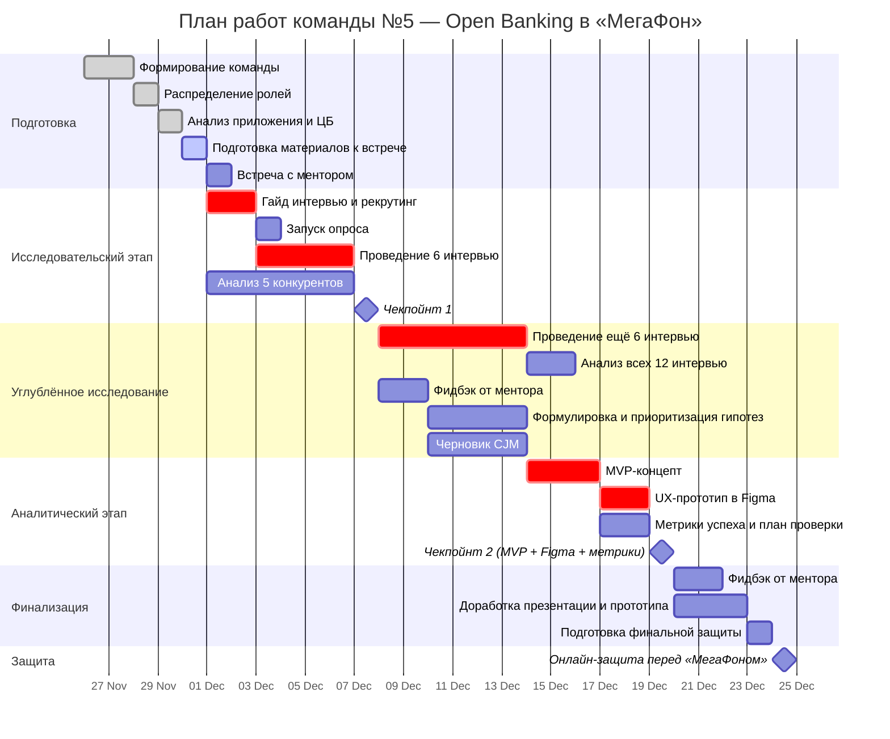

## Команда №5 — Open Banking в «МегаФон»

Участники:
- Дмитриев Дмитрий
- Кузьмицкий Дмитрий
- Данилов Глеб
- Шумко Игорь

### Наше понимание задачи:

Превратить ЛК «МегаФон» из утилитарного инструмента в **персональный финансовый хаб**, объединяющий связь и финансы, чтобы:
 - Повысить вовлечённость и retention  
 - Упростить оплату услуг без выхода из приложения  
 - Подготовить основу для развития финтех-платформы

 **Что уже есть в приложении**:  
 - Раздел **«Платежи»**: баланс, оплата, автоплатёж, переводы  
 - Раздел **«Деньги»**: займы, страховки, карты (только от партнёров)  
 - **СБП уже используется** — но пользователь **выходит в банк** для подтверждения

 **Проблема**:  
 Пользователь не видит ценности в ЛК — платит через банки, не возвращается в приложение → низкая вовлечённость + упущенные возможности монетизации.

### Распределение ролей

| Участник             | Роль                   | Ключевые задачи                                                                                                                                                                                                                                                                                                           |
| -------------------- | ---------------------- | ------------------------------------------------------------------------------------------------------------------------------------------------------------------------------------------------------------------------------------------------------------------------------------------------------------------------- |
| **Дмитриев Дмитрий** | Тимлид                 | - организует рабочий процесс команды; - распределяет задачи и контролирует сроки; - координирует коммуникацию с ментором и партнёром; - фиксирует договорённости внутри команды; - отвечает за своевременную загрузку промежуточных и итоговых материалов; - помогает корректировать роли, если требуется. |
| Кузьмицкий Дмитрий   | Исследователь          | - проводит интервью, опросы, наблюдения (онлайн/офлайн); - формирует гайды, сценарии общения, критерии отбора респондентов; - собирает данные о пользовательском опыте; - выявляет pain points, ожидания и барьеры; - готовит выводы для гипотез и CJM.                                                       |
| Шумко Игорь          | Аналитик               | - анализирует рынок, конкурентов, продукты-аналоги; - структурирует количественные данные и метрики; - помогает формировать юнит-экономику, P&L или расчёт эффектов; - поддерживает продуктолога в приоритизации гипотез; - проверяет корректность данных, предположений и расчётов.                          |
| Данилов Глеб         | Продуктолог            | - формулирует продуктовую проблему и цели; - формирует и приоритизирует гипотезы; - предлагает сценарии улучшений и варианты решений; - проектирует способ проверки гипотез (метрики, эксперименты, РОС); - собирает концепцию MVP и готовит логику roadmap.                                                  |
| **Дмитриев Дмитрий** | Дизайнер / Прототипист | - визуализирует решения для MVP: макеты, прототипы, пользовательские флоу; - работает с CJM, схемами интерфейсов, сценариями; - обеспечивает понятную подачу решения в презентации; - помогает команде донести идею через визуальные артефакты.                                                                  |

### План работ (до 24 декабря)

| Этап              | Дедлайн | Активности                                      | Ответственный            |
| ----------------- | ------- | ----------------------------------------------- | ------------------------ |
| Исследовательский | 7 дек   | Интервью (6), опрос запущен, анализ конкурентов | Исследователь + Аналитик |
| Исследовательский | 14 дек  | Интервью (12), CJM, гипотезы                    | Вся команда              |
| Аналитический     | 19 дек  | Финальные выводы, MVP-концепт, прототип в Figma | Продуктолог + Дизайнер   |
| Финализация       | 23 дек  | Презентация, фидбэк от ментора                  | Тимлид                   |
| Защита            | 24 дек  | Онлайн-защита перед «МегаФоном»                 | Вся команда              |

```mermaid
gantt
    title План работ команды №5 — Open Banking в «МегаФон»
    dateFormat  YYYY-MM-DD
    axisFormat  %d %b

    section Подготовка
    Формирование команды                :done,    des1, 2025-11-26, 2d
    Распределение ролей                 :done,    des2, after des1, 1d
    Анализ приложения и ЦБ              :done,    des3, after des2, 1d
    Подготовка материалов к встрече     :active,  des4, after des3, 1d
    Встреча с ментором                  :         des5, after des4, 1d

    section Исследовательский этап
    Гайд интервью и рекрутинг           :crit,    res1, 2025-12-01, 2d
    Запуск опроса                       :         res2, after res1, 1d
    Проведение 6 интервью               :crit,    res3, after res1, 4d
    Анализ 5 конкурентов                :         res4, 2025-12-01, 6d
    Чекпойнт 1                          :milestone, cp1, 2025-12-07, 1d

    section Углублённое исследование
    Проведение ещё 6 интервью           :crit,    res5, 2025-12-08, 6d
    Анализ всех 12 интервью             :         res6, after res5, 2d
    Фидбэк от ментора                   :         res7, 2025-12-08, 2d
    Формулировка и приоритизация гипотез:         res8, 2025-12-10, 4d
    Черновик CJM                        :         res9, after res7, 4d

    section Аналитический этап
    MVP-концепт                         :crit,    ana1, after res9, 3d
    UX-прототип в Figma                 :crit,    ana2, after ana1, 2d
    Метрики успеха и план проверки      :         ana3, after ana1, 2d
    Чекпойнт 2 (MVP + Figma + метрики)  :milestone, cp2, 2025-12-19, 1d

    section Финализация
    Фидбэк от ментора                   :         fin1, 2025-12-20, 2d
    Доработка презентации и прототипа   :         fin2, 2025-12-20, 3d
    Подготовка финальной защиты         :         fin3, after fin2, 1d

    section Защита
    Онлайн-защита перед «МегаФоном»     :milestone, final, 2025-12-24, 1d
```

## 📅 **Детальный поэтапный план (до 24 декабря)**

### 📆 **До 1 декабря**
- [x] Сформировать команду
- [x] Распределить роли  
- [x] Проанализировать приложение и документы ЦБ  
- [ ] Подготовить материалы к встрече с ментором

### 📆 **1–7 декабря**
- [ ] Составить **гайд интервью** и **план рекрутинга**
- [ ] Запустить **опрос**
- [ ] Провести **6 интервью**  
- [ ] Проанализировать **5 конкурентов**
- [ ] Сдать **Чекпойнт 1** (7 декабря)

### 📆 **8–14 декабря**
- [ ] Завершить **12 интервью**, проанализировать данные    
- [ ] Получить фидбэк от ментора (10 декабря)
- [ ] Сформулировать **10+ гипотез**, приоритизировать (ICE/RICE)
- [ ] Создать **черновик CJM** по сценарию «???»

### 📆 **15–19 декабря**
- [ ] Разработать **MVP-концепт**
- [ ] Создать **UX-прототип в Figma** (основной флоу + экраны безопасности)  
- [ ] Определить **метрики успеха** и **план проверки**  
- [ ] Сдать **Чекпойнт 2** (19 декабря)

### 📆 **20–23 декабря**
- [ ] Получить фидбэк от ментора  (22 декабря)
- [ ] Доработать презентацию и прототип  
- [ ] Подготовить **финальную защиту**

### 📆 **24 декабря**
- [ ] **Онлайн-защита** перед «МегаФоном»

### Идеи по решению кейса

**??? Заполнить ???**

Инсайт: 
В проблематике указана проблема: "Существуют опасения по поводу безопасности, хранения данных и конфиденциальности" . Если она на глубинных интервью подтвердится, предлагается интегрировать антифрод мобильного оператора с банковскими продуктами и предоставлять сервис, аналогичный ТБанку - "Возврат денежных средств за мошенничество".
 

### Вопросы к автору кейса:
1. Планируется ли получение банковской лицензии и реализация собственных банковских продуктов, как основы необанкинга (дебетовая карта, накопительный счет, вклад и пр.).
2. Планируется ли осуществление трансграничных переводов ДС через собственного платежного агента, что могло бы стать важным фактором привлечения (в настоящий момент есть ряд пополнений сервисов за границей, но перечень ограничен).
3. В кейсе указаны переводы по СБП - можете детализировать, речь про прием переводов/пополнение через QR (c2c) или про оплату через приложение со счетов других карт (аналогично СБПэй, C2B).
